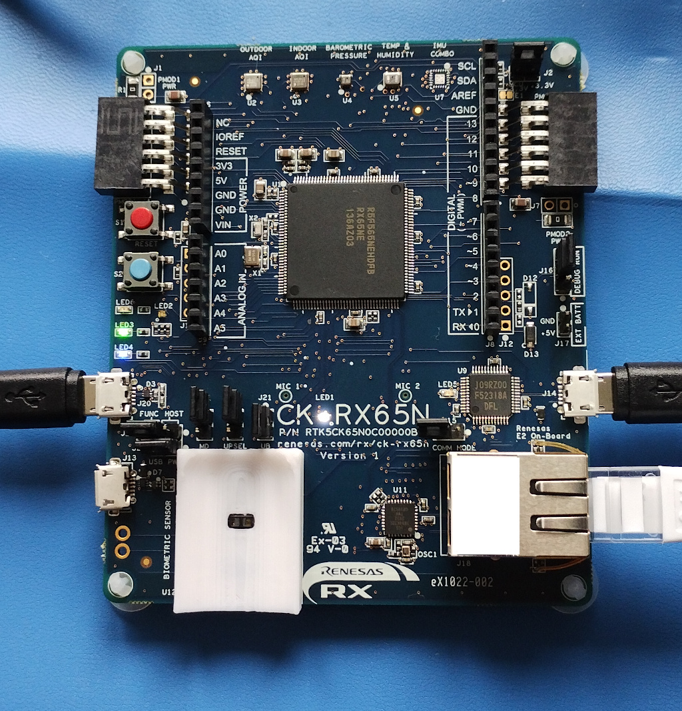

# Using Renesas RX65N Trusted Secure IP (TSIP) with IoTConnect

This document describes how to use the RX65N Trusted Secure IP (TSIP) for hardware-based TLS 
client certificate authentication with iotconnect on the Renesas CK-RX65N board. This document describes how it is used with the ck-rx65n sample project.



## Prerequisites

* Renesas CK-RX65N Cloud Kit board (the PCB is blue, rather than green (that is the old Rx65N cloudkit board whose MCU variant is without the TSIP security module)
* Have followed the Renesas CK-RX65N Quickstart Guide [here | QUICKSTART_DEMO.md]
* Windows PC (this setup guide details installation, etc. on a Windows PC).
* Internet connection with ethernet connection for the Renesas board’s ethernet.

## Download and install the TSIP driver

A binary version of the TSIP driver is available to download from https://www.renesas.com/us/en/software-tool/trusted-secure-ip-driver#design_development

You need an account on the Renesas website in order to download the TSIP driver linked on 
the page above and need to accept the EULA it presents when you download the zip file. 

There is also an accompanying application note available linked in this section of the page:
https://www.renesas.com/us/en/software-tool/trusted-secure-ip-driver#document

Please consult Renesas documentation on installing the TSIP driver FIT module which is included in the binary above 
`RX Family TSIP (Trusted Secure IP) Module Firmware Integration Technology (Binary version)` (r20an0548ej0117-rx-tsip-security.pdf) and `Board Support Package Module Firmware Integration Technology Application Note` (R01AN1685xJxxxxxx).

## DLM server & Provisioning Key Generation
The Renesas DLM server provides a key-wrapping service and is hosted at https://dlm.renesas.com/keywrap/

It is used to create an encrypted provisioning key that will be used later to encrypt the private and public RSA keys for provisioning them into the RX65N MCU for use with X.509 client authentication.

The following steps need to be performed:
* Create a PGP key and exchange this with the DLM service via the DLM website linked above (RSA 4096-bit keys are recommended)
* Create a provisioning key using the `Renesas Secure Flash Programmer` tool which is also included in the TSIP driver zip file discussed above.
* Encrypt the generated provisioning key using PGP and your PGP key that you exchanged with the DLM service and upload the PGP encrypted provisioning key to the DLM service.
* The DLM server will re-encrypt the provisioning key with the HRK (hardware root key) and email the encrypted provisioning key to you. This encrypted provisioning key is later used with the `Renesas Secure Flash Programmer` tool to encrypt all keys that will be provisioned into the MCU.

Please consult the [manual for the DLM keywrap service for further details](https://dlm.renesas.com/manual/KeyWrap_Service_Operation_Manual.pdf)

## Generate CA X.509 certificate and a 1024-bit RSA client/device X.509 certificate
Perform the following steps to generate the CA X.509 certificate and a 1024-bit RSA client/device X.509 certificate:
* First change directory to the location containing the certificate generation tools
```
$ cd iotc-azurertos-sdk/samples/ck-rx65n/iotc-azrtos-sdk/iotc-c-lib/tools/ecc-certs
```
* Populate the `iotconnect-config` file according to your CPID and other details using your text editor of choice
* Generate a Root CA certificate
```
$ ./makecerts.sh root
```
* Generate a client/device certificate that is signed by the Root CA cert generated in the step above replacing _<my-device-id>_ with your desired device-id/DUID 
```
$ ./makecerts.sh device_rsa1024 <my-device-id>
```
*  This will create the client/device certificate in multiple formats (PEM, DER, and C array format DER, and C string format PEM). Using an example where <my-device-id> is "my-device-id"
    * `my-device-id-crt.pem` - PEM formatted 1024-bit RSA X.509 certificate
    * `my-device-id-key.pem` - PEM formatted 1024-bit RSA private key
    * `my-device-id-crt.der` - DER formatted 1024-bit RSA X.509 certificate
    * `my-device-id-key.der` - DER formatted 1024-bit RSA private key
    * `my-device-id-c-array.txt` - DER RSA private key and X.509 certificate in a C array format
    * `my-device-id-c-snippets.txt` - PEM RSA private key and X.509 certificate in C string format 

## Upload the generated CA certificate to IoTConnect website
Navigate to the device overview page of the IoTConnect website and you will see the certificates section at the bottom of the page as in the screenshot below


Create/Upload the new CA certificate to IoTConnect as shown in below screenshot. Note that there is a softlimit of 4 CA certificates in IoTConnect


## Create a template that uses the CA certificate
Navigate to the Devices page of the IoTConnect website create a new Template via the navigation bar at the bottom of the screen


Create a new template


The expected data and commands are the same as in the CK-RX65N IoTConnect quick start documentation for symmetric-key authentication 
with IoTConnect and as shown in the screenshots below:


Finally create a device that uses the new template and associates the appropriate CA certificate with it


## Convert the public and private key for use with TSIP
The public and private RSA keys associated with the client/device X.509 certificate need to be encrypted with the previously created provisioning key.

This is achieved using the `Renesas Secure Flash Programmer` tool which is also included in the TSIP driver zip file discussed above.

NOTE: the generated contents of the `Renesas Secure Flash Programmer` key_data.c and key_data.h files can vary between different versions of the TSIP driver package, so ensure you are using the `Renesas Secure Flash Programmer` tool version that is supplied with the TSIP driver FIT package version that you are using in your e2studio project.

To convert the 1024-bit RSA key into a format suitable for use with the `Renesas Secure Flash Programmer` 
tool run the following command, replacing _<cpid>_ with your CPID specified in the `iotconnect-config` file
and _<device-key-pem-file>_ with your DUID value specified in _<my-device-id>_ prepended to `-key.pem` 
so a device-id/DUID of `my-example-device` would become `my-example-device-key.pem`:
```
openssl asn1parse -in ./<cpid>/<device-key-pem-file>  | awk -F: 'NR==3{print $4} NR==4{printf("%08d\n", $4)} NR==5{print $4}'  | tr -d "\n"`
```

The output will look something similar to the following:
`C563B74C02BD5FF0E6090CFED09AF326F659FC8043A25B015A0DE2E56145E639B96FA7AFC85FC45AD0EF0CCEFAC50DCCADA2392EA4F7628758F784FDD40A57D0DBBE022199A4FD2675B626063CFA9CDEC0F4B72241FC73D6A2D07D0CEC0E831D4873780AD102888C9EF3A375AE01513157A70888ABC23718099F4D2EB46EBC290001000128C97008AED03ED0E257A06DCEE115B9495252D096292830E150D93F9897FEF8928EB5D1A6CFD31D08EB3C7450710366F5C1FD9ADBCF9A766935CC2F3EEF5C3198829D715C1B0CB674A2485C0FB2F5EFA27D8FC6A2C11DA7A14A6F8000B3830E6794F899036F9FED1C9271BC570C3FBBB5AEC2A65F5900ADC2CE1403CD45D561`

Use the `Key Wrap` tab of `Renesas Secure Flash Programmer` tool and enter the details as 
shown in the following screenshots and the key data generated by the command above.

Click the `Generate Key Files` button and save the key_data.c and key_data.h files. 

Copy the saved `key_data.c` and `key_data.h` files to the `iotc-azurertos-sdk/samples/ck-rx65n/basic-sample/src/` directory replacing the ones that already exist in the project.

Copy the contents of the `<cpid>_<my-device-id>_crt_der[]` array in file `./<cpid>/<my-device-id>-c-array.txt` to the `sample_device_cert_ptr[]` array and the respective length in `sample_device_cert_len` in the file `ck-rx65n/basic-sample/src/sample_device_identity.c` in the e2studio project
 
Build the `basic-sample` project in e2studio and flash the device.


