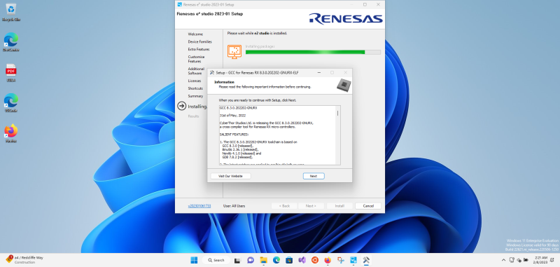
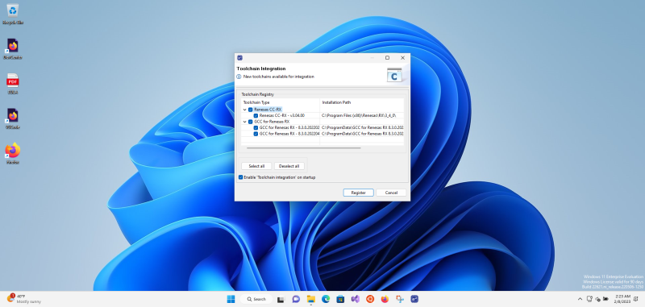
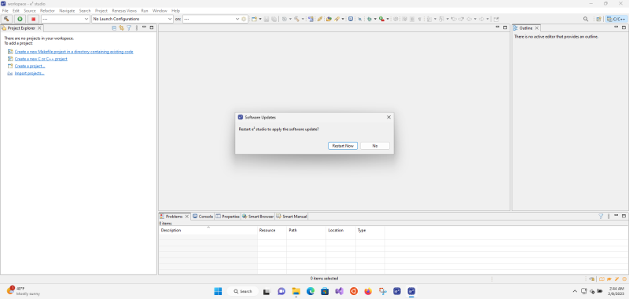
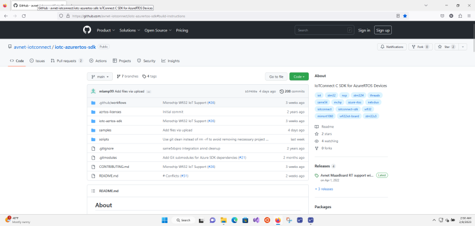
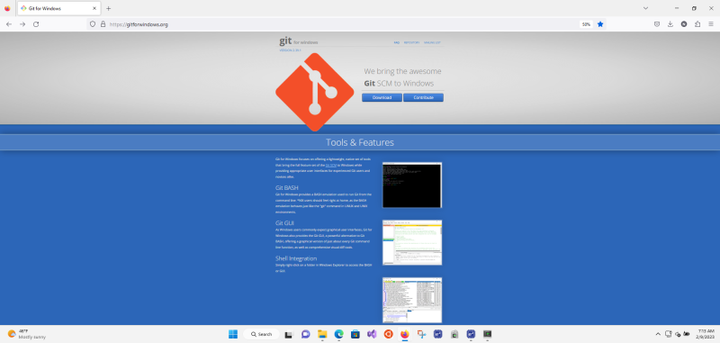
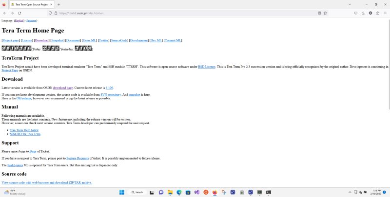
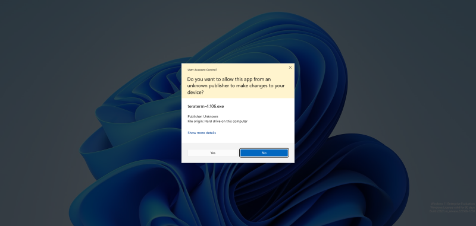
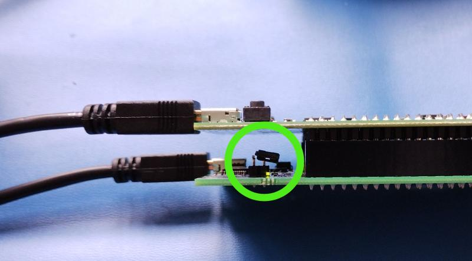
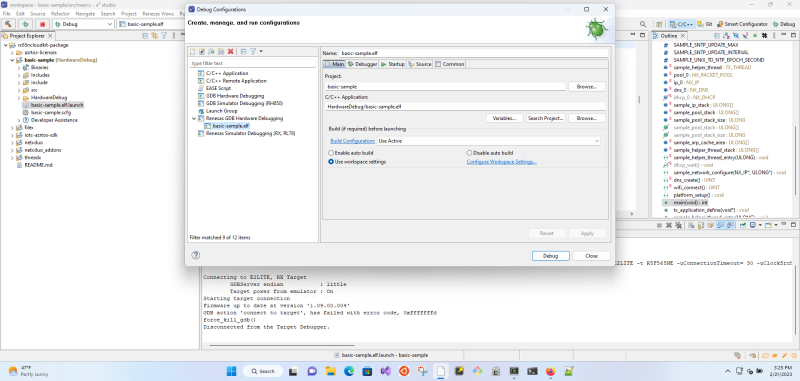
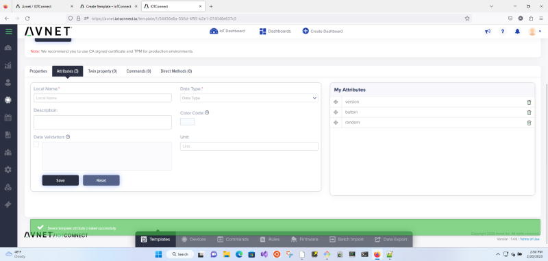

# Renesas RX65NX Cloud Kit Quickstart Guide

This document is intended to introduce the use of the green Renesas RX65N Cloud
Kit board(s), using the rx65ncloudkit sample project, with IoTConnect.

## Prerequisites

- Windows PC (this setup guide details installation, etc. on a Windows PC; a
  Linux setup might be setup in an analogous manner).
- Internet connection
- 2.4GHz WiFi access point with known SSID (for the Renesas board’s internet
  connection)
- optionally: plastic tweezers

## Download and install latest Renesas GCC

You will need to register to [download the latest GCC
release](https://llvm-gcc-renesas.com/rx-download-toolchains/).

RENESAS GCC WEBSITE

Please consult Renesas documentation on installing the latest GCC release.

EXAMPLE STEPS TO INSTALL THE LATEST GCC RELEASE

## Download and install latest e2 studio

You will need to register to [download the latest e2 studio
release](https://www.renesas.com/us/en/software-tool/e2studio-information-rx-family).

E2 STUDIO WEBSITE

Please consult Renesas documentation on installing the latest e2
studio.

The following options are required for Cloudkit development: RX support, and
optionally Jlink debugging, terminal, and git support.

EXAMPLE STEPS TO INSTALL E2 STUDIO

## Run/setup e2 studio

You will need to use the your Renesas account information that was used to
download the latest e2 studio release when setting up/registering
e2 studio.

EXAMPLE STEPS TO RUN AND SETUP E2 STUDIO

## Optional: Update e2 studio to latest versions

"Check for Updates" – can be a little slow.

EXAMPLE STEPS TO UPDATE E2 STUDIO

## Optional: setup egit in e2 studio

If using egit support in e2 studio then [follow Renesas
notes](https://www.renesas.com/us/en/document/apn/integrated-development-environment-e-studio-how-use-egit-e-studio).

EXAMPLE STEPS TO SETUP EGIT

## Using git clone to access iotc-azurertos-sdk

The `git clone` details can be found on the [IotConnect Azure RTOS SDK github
project](https://github.com/avnet-iotconnect/iotc-azurertos-sdk).

IOTC-AZURERTOS-SDK WEBSITE

### Using e2 studio to git clone iotc-azurertos-sdk

EXAMPLE STEPS TO USE EGIT TO CLONE IOTC-AZURERTOS-SDK

### Install "Git for Windows" and clone iotc-azurertos-sdk

Alternatively, install ["git for Windows"](https://gitforwindows.org/).

GIT FOR WINDOWS WEBSITE

And use the bash shell to clone the repository – right-click on directory -
"Other options", then "Git Bash" to launch the shell.

EXAMPLE STEPS TO LAUNCH GIT FOR WINDOWS

### Windows Subsystem for Linux (WSL)

Alternatively, install Windows Subsystem for Linux (WSL) and clone the
repository

### Cygwin

Alternatively, install [Cygwin](https://www.cygwin.com) - and ensure that
`git`, `unzip` and at least one of `wget` or `curl` are installed - and clone
the repository.

## Setup the Renesas iotc-azurertos-sdk project fully

The setup process requires a bash-like shell (not cmd) – could use Windows
Subsystem for Linux (WSL), MinGW shell from "git for Windows", or Cygwin. The
shell needs access to:

- `git`
- `unzip`
- `wget`, or `curl`

To setup the `iotc-azurertos-sdk` rx65ncloudkit project fully:

- change into the `scripts` directory in the `iotc-azurertos-sdk` project: `cd
  iotc-azurertos-sdk/scripts`
- run the script: `setup-project.sh rx65ncloudkit`

EXAMPLE STEPS TO RUN SETUP-PROJECT.SH IN GIT FOR WINDOWS

## Import iotc-azurertos-sdk rx65ncloudkit project into e2 studio

Need to import the `samples/rx65ncloudkit` project into e2 studio to
build and debug - note deselect any "CMake Project" items, so that the
r65ncloudkit (and its subprojects) are imported as Eclipse projects.

Once the project is imported into e2 studio, then check that the
latest version of the compiler is used for rx65ncloudkit project and each of
the subprobjects.

Expand the rx65ncloudkit project.  Right click on "basic-sample" and bring up
the "C/C++" properties sheet.  Ensure that the toolchain being used is the
latest one – if not, then select the latest one, and "Apply and Close".

There may be other dialogs about smart-manual – accept/dismiss as required:

## Update the RX Driver Package (FIT modules)

Expand "basic-sample" and the "src" subdirectory, so that "basic-sample.scfg"
can be seen in the "Project Explorer" pane.

Double-click on "basic-sample.scfg" to bring up the "Overview Information".
Download any FIT modules.

Press the "Generate Code" button at the top-right corner of the "Project
Explorer" pane.

EXAMPLE STEPS TO UPDATE E2 STUDIO FIT MODULES

Missing components (in the component tab) are shown as grey, clicking on them
will suggest a download.

## Clean and build the project

Right-click on the basic-sample item under the rx65ncloudkit project in the
"Project Explorer" and select "Clean Project" in case any previous build
artefacts are present.

Right-click on the basic-sample item in the "Project Explorer" and select
"Build Project".

### Build products

Build product (`basic-sample.elf`, `basic-sample.mot`, etc.) is generated by
default under the `rx65ncloudkit/basic-sample` directory in the `HardwareDebug`
sub-directory.

## Setup the RX65N Cloud Kit board(s)

[Setup the RX65N Cloud Kit](https://www.renesas.com/us/en/products/microcontrollers-microprocessors/rx-32-bit-performance-efficiency-mcus/rx65n-cloud-kit-renesas-rx65n-cloud-kit).

Connect the two USB-micro leads:

The power LED should be lit. The power LED is at the top left hand corner (in
the diagram above) of the upper (cloud option) board – above the mini-USB port
on the lower (target) board.

### Setup a terminal connection

Install
[termite](https://www.virtual-serial-port.org/articles/alternative-to-termite-terminal/),
[Tera Term](https://ttssh2.osdn.jp/index.html.en), or a similar terminal
application.

May need to press the "reset" button to restart to see output.

EXAMPLE TERA TERM INSTALLATION

The terminal settings to connect are:

- Chose appropriate COM port. Note: In Linux the terminal may enumerate as
  `/dev/ttyACM0`.
- 115200 baud rate
- 8-bit data
- No parity

## Running/debugging a build generated by e2 studio

_Warning this will overwrite any software flashed/supplied previously on the
RX65N Cloud Kit board._

Need to remove the large jumper on the lower (target) board before
running/debugging a build.  Obviously, remove any USB leads to power off the
board – and a set of plastic tweezers may be useful.

The jumper is set on the left-hand picture, and "removed" (it's just sitting on
one pin, to avoid losing it).

### Create a debug .launch file

If a .launch file is not present in the basic-sample directory, e.g the .launch
file may be called `basic-sample HardwareDebug.launch`, then you will need to
create a suitable .launch file.

EXAMPLE OF CREATING A .LAUNCH FILE

Ensure the rx65ncloudkit board is connected to the PC and is powered up, i.e.
the top-left green LED is lit.

Right click on the basic-sample and select "Debug as" then "Renesas GDB
Hardware Debugging".

Select "E2 Lite (RX)" as the debug hardware

Select "R5F565NE" as the "target device"

This should create a `basic-sample.elf.launch` file.

This file may not immediately work, so right-click again on basic-sample to
bring up the "Debug Configurations" panel

Check that "E2 Lite (RX)" and "R5F565NE" are selected

Click on the "Connection Settings" tab, and set the "Connection Type" to be
"Fine"

"Apply" and "Close", and then it should be possible to debug the rx65nxcloudkit
IoTConnect platform.

### Debug code

Press the "Launch in ‘Debug’ mode" button ("bug") on the left-side of
e2 studio.

If there are errors:
- check that the board is connected via USB
- check that the jumper has been removed (once powered off)

EXAMPLE STEPS TO RUN/DEBUG

Respond appropriately to any pop-ups relating to Windows Defender Firewall prompts.

Switch to the debug perspective when prompted.

The build will have two default breakpoints already enabled, so presume the
Resume button (green "left-pointing triangle") in the middle of e2
studio twice to enable to code to execute past those two breakpoints.

Note: once the first break-point is passed then a red LED will light at the
bottom left of the rx65ncloudkit board.

Output should be visible in any attached terminal now.

When finished press the Terminate button (red "square") next to the Resume
button.

To debug again, press the debug button.

To return to C/C++ development, select the "Window", then "Perspective", then
"Open perspective", then "C/C++ project".

To return to debugging/running, select the "Window", then "Perspective", then
"Open perspective", then "Debug".

#### Developing with e2 studio

May need to select the "Refresh" option by right-clicking on a project in
e2 studio if/when the git branch has been changed, or other
"external" changes have been made.

Also if a git pull modifies any git submodules, then will likely need to rerun
setup-project.sh.

#### Setting SSID and Password in `app_config.h`

Without editting `app_config.h` the code will produce the following output:

In e2 studio edit the `app_config.h` to specify the `WIFI_SSID` of a
2.4 GHz WiFi network and its `WIFI_PASSWORD`, then the code will produce output
similar to that below (the "Wi-Fi Network" will display the `WIFI_SSID`
specified in `app_config.h`):

Note: If the board is powered-down and the jumper replaced, it seems that the
board will be flashed to run the newly "debugged" code, replacing previous
code.

## Create a sequence of 16-64 random bytes that are Base64 encoded - for use as a Symmetric Key

To create a random symmetric "key" we will generate a random 32 byte sequence
and then Base64 encode it – so that the binary values can be shared easily.

Run this command in a shell, e.g. in Git for Windows Bash, Cygwin, etc.:

    dd if=/dev/urandom bs=32 count=1 status=none | base64

A symmetric key is used to both encode and decode - so the same key is used on
the IoT device and on the IoTConnect server.

Make a note of this output, as it will be used to setup the IoTConnect template
for the device on the IoTConnect dashboard – and in the application
configuration file `app_config.h` that will be compiled/built and run on the
device.  This is important as isn’t possible to recover key information once
added to the IoTConnect dashboard – also consider if key information might get
removed from any local iotc-azurertos-sdk git repository (if it gets cleaned,
branches are deleted, or changes get reverted). Obviously, key information
shouldn’t be pushed to external public repos.

In this case the symmetric key is:

    YzlgdRbYcreYW1fhjwxO4b3X7hBlDY3OVuw6q9wDbAo=

## IoTConnect template and device

For further information, please consult the "Knowledge Base" which can be found
on the [left side of the IoTConnect dashboard](https://help.iotconnect.io).

### Create IoTConnect template

Log into your IoTConnect account and open the appropriate Device page which can
be found on the [left side of the IoTConnect
dashboard](https://avnet.iotconnect.io/device/1).

The template page can be selected by using the "Templates" tab at the bottom of
the page.

Press "Create Template" at the top right corner of the page to create a new
template.

When creating the template choose a unique name for the "Template Code" (which
is a maximum of 10 characters and must start with a letter) and a useful
description in the "Template Name".  Choose "Symmetric Key" for the
"Authentication Type" and choose "2.1" for the "Device Message Version".

When the template is saved, we can add attributes – "measurements" (and types)
– for values that will be sent by the rx65ncloudkit board.

Click "Attributes (0)" and add a version "STRING" value and "Save" it.

Add a "button" attribute with BOOLEAN type, and a "random" attribute with
DECIMAL type.

Note: in the rx65ncloudkit basic-sample the attribute values are sent using
`iotcl_telemetry_set_xxx()` style commands.

Make a note of the template name, as this will be used as the "Template" to
create the IoTConnect device in the next step – but it will be visible in the
drop-down list.

### Create IoTConnect device

Log into your IoTConnect account and open the appropriate Device page which can
be found on the [left side of the IoTConnect
dashboard](https://avnet.iotconnect.io/device/1).

The device page can be selected by using the "Devices" tab at the bottom of the
page.

- Chose a "Unique Id" for your device – this will be use in `app_config.h`
  built/compiled in the device later.
- Chose a "Display Name" for your device.
- Select an appropriate "Entity" – this is a pre-populated menu item.
- Select the "Template" display name that was created in the previous step –
  this will require filling in extra fields "Primary Key" and "Secondary Key".
- Use the symmetric key that was generated previously, including any trailing
  "=" signs, e.g. `YzlgdRbYcreYW1fhjwxO4b3X7hBlDY3OVuw6q9wDbAo=` as the value
  for the "Primary Key" and the "Secondary Key".

### _WARNING!!! this generated Symmetric Key didn’t work I’ve had to use Russell’s value_ cGFzc3dvcmRwYXNzd29yZAo=

Values I generated by `dd` and encoded weren't accepted as valid `base64`
encodings on the IoTConnect create a device page -- note the `dd` command is
borrowed from `stm32u5/QUICKSTART_DEMO.md`

When I created the template I pasted the Russell’s same value in both the
"Primary Key" and the "Secondary Key" and included the trailing "=" equals
sign.

## Updating `app_config.h`

In `app_config.h` you will need to specify:

    //
    // Copyright: Avnet 2022
    // Created by Russell Bateman <rbateman@witekio.com> on 11/18/22.
    //
    
    #ifndef APP_CONFIG_H
    #define APP_CONFIG_H
    
    #define IOTCONNECT_CPID ""
    #define IOTCONNECT_ENV  ""
    
    #define IOTCONNECT_DUID "" // you can supply a custom device UID, or...
    #define DUID_PREFIX "" // mac address will be appended in format 012345abcdef
    
    // if it is not defined, device certs will be used in iotconnect_app.c
    #define IOTCONNECT_SYMETRIC_KEY ""
    
    #define SAMPLE_SNTP_SERVER_NAME ""    /* SNTP Server.  */
    
    #define WIFI_SSID ""
    #define WIFI_PASSWORD ""
    
    #endif // APP_CONFIG_H

After updating `app_config.h`, then in e2 studio: refresh, clean,
and build the rx65ncloudkit basic-sample, so that any modifications are
incorporated into the binary -- before debugging/running, or flashing the
board.

### `WIFI_SSID` and `WIFI_PASSWORD`

See previous section and fill in your 2.4 GHz WiFi access point SSID and
password.

### `SAMPLE_SNTP_SERVER_NAME`

Choose a suitable public NTP time server, e.g. "time.google.com".

### `IOTCONNECT_CPID` and `IOTCONNECT_ENV`

Log into your IoTConnect account and open the Key Vault which can be found on
the [left side of the IoTConnect
dashboard](https://avnet.iotconnect.io/key-vault).

#### `IOTCONNECT_CPID`

This is the value under "CPID:" at the top left of the "Home / Setting / Key
Vault" screen.

#### `IOTCONNECT_ENV`

This is the value under "Environment:" at the top middle of the "Home / Setting
/ Key Vault" screen.

### `IOTCONNECT_DUID` and `DUID_PREFIX`

Log into your IoTConnect account and open the appropriate page for the device
that you created previously.  The device should be found on the [left side of
the IoTConnect dashboard](https://avnet.iotconnect.io/device/1).

#### `IOTCONNECT_DUID`

This is the "Unique ID" for the IoTConnect device that you previously created.

#### `DUID_PREFIX`

This can be ignored provided that `IOTCONNECT_DUID` has some meaningful defined
value.

### `IOTCONNECT_SYMETRIC_KEY`

Paste your previously created Base64 encoded symmetric key.

## Running the rx65ncloudkit board with customised `app_config.h`

After saving/refreshing/rebuilding and initialising the debug session in
e2 studio, example output is shown on the left in the terminal (Tera
Term VT):

The reported measurement values have been highlighted – and changed values can
be seen in the terminal output.

## Viewing IoTConnect device measurements

### Measurements

#### random

The "random" measurement will be a random DECIMAL value in the range 0-100.
This can be seen in the terminal output.

#### version

The "version" measurement will be a constant "01.00.00" STRING. This can be
seen in the terminal output.

#### button

The "button" value will return false BOOLEAN value when the lower button is not
pressed.  This can be seen in the terminal output.

The "button" value will return true BOOLEAN value when the lower button is
pressed.

### Viewing IoTConnect device measurements on the IoTConnect Dashboard

Log into your IoTConnect account and open the appropriate Device page which can
be found on the [left side of the IoTConnect
dashboard](https://avnet.iotconnect.io/device/1).

The device page can be selected by using the "Devices" tab at the bottom of the
page.

The connected devices will be shown as a green "CONNECTED" status – may need to
refresh the page to get an up to date view.

Click on the connected device name, to open its specific page

### Live Data

Click on the "Live Data" item on the left of the device’s own page.

Note: obviously this requires the IoTConnect device to be connected and
actually sending data.  If the device has been previously connected, but is not
currently connected, then "Historical Data" should be used.

#### Telemetry

The "Telemetry" tab is a mirror of the data sent by the IoTConnect device – as
shown in the data element of the JSON shown in the terminal output from the
device.

#### Graph

The "Graph" tab is a graph of numerical attribute values as sent by the
IoTConnect device over time.

#### Tabular

The "Tabular" tab is a table of attributes values as sent by the IoTConnect
device.

## Appendix: Direct flashing a build generated by e2 studio

### Install Renesas Flash Programmer

Follow the [Renesas Flash Programmer (Programming GUI) installation
instructions](https://www.renesas.com/eu/en/software-tool/renesas-flash-programmer-programming-gui#overview).

EXAMPLE STEPS TO INSTALL RENESAS FLASH PROGRAMMER

### Use Renesas Flash Programmer

To flash the RX65NCloudKit board follow the [flashing
instructions](https://www.renesas.com/eu/en/document/mat/renesas-flash-programmer-v311-flash-memory-programming-software-users-manual?r=488871).
