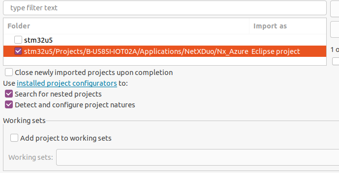
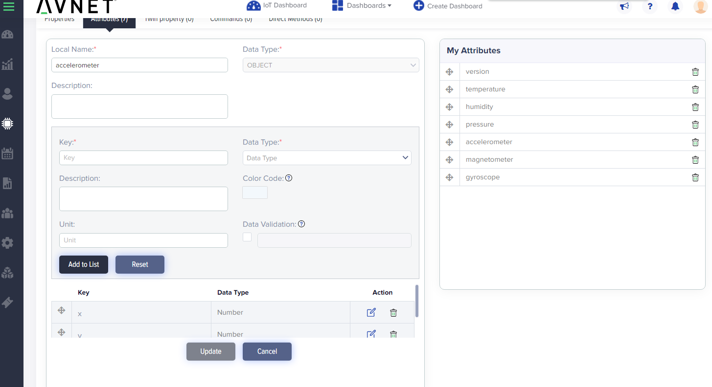
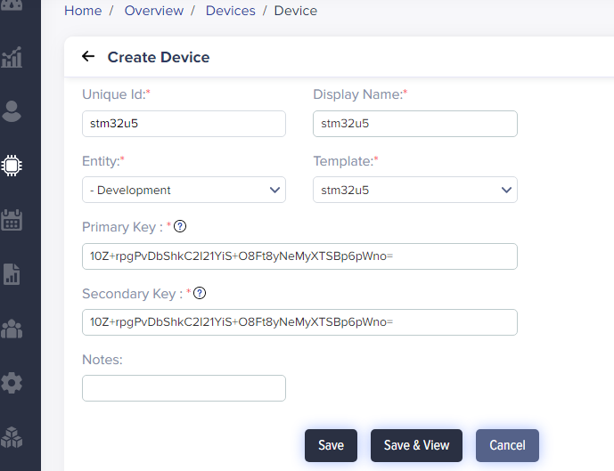

## Introduction

This document aims to provide a step-by-step-guide way to test and evaluate the 
[B-U585I-IOT02A STM32U4 Discovery kit for IoT](https://www.st.com/en/evaluation-tools/b-u585i-iot02a.html) board 
with IoTConnect.

### Project Build Setup

The software must be built and programmed onto the board by using the following steps:

* If on Windows, download and install [MSYS2](https://www.msys2.org/). [WSL](https://learn.microsoft.com/en-us/windows/wsl/about) or GIT Bash may also work.
* Ensure that you have git command line installed. If on Windows, you can use [this link](https://gitforwindows.org/).   
* Clone this repo
* Download the [X-CUBE-AZURE Expansion Package](https://www.st.com/en/embedded-software/x-cube-azure.html) version 2.1.0, 
and place the zip into the [samples/stm32u5](samples/stm32u5) directory.
* In a bash shell, execute:

```shell
cd <root of this repo>
scripts/setup-project.sh stm32u5 
```

* Download, install and open the [STM32CubeIDE](https://www.st.com/en/development-tools/stm32cubeide.html).
* In STM32CubeIDE, select *File -> Open Projects from File System*.
* Select the [samples/stm32u5](samples/stm32u5) directory of this repo in the dialog box and click *Finish*.
* Uncheck the stm32u5 root project and leave the other project checked like this:



### IoTConnect Subscription Information

[IoTConnect](https://iotconnect.io) is availabe as a SaaS hosted subscription service or available as a PaaS subscription hosted on a client's infrastructure. SaaS IoTConnect subscriptions are available for business and personal accounts, and both are deployed on a production cloud instance.  Personal accounts are currently available through a North American instance of IoTConnect built on Microsoft Azure and is available for global use.  Personal IoTConnect accounts support between 1 and 100 devices, and can be setup in minutes through credit card payment on [IoTConnect Subscription Site](https://subscription.iotconnect.io/subscribe). Business SaaS accounts are available on both AWS and Azure, and deployed on EMEA and North American instances.  The Business SaaS platforms will support 1 to over a million devices, allow unlimited users, and can be setup in 1-business day through your local Avnet, Avnet Silica, Avnet Abacus, and EBV Elektronik account managment team. If you are not connected to an Avnet representative already, one can be reached by the "Contact Us" link on the Subscription Page. PaaS subscriptions are available in all Azure and AWS serviced regions, and require an Avnet license agreement and a cloud subscription service through Anvet or directly through the cloud sevices provider. 

For registration, you will need an email address, phone number, and unique company name. When you sign up for an account, you are creating an organizational instance.  You can add others later into this account with various permissions, including admistrative rights.  But note that users within the same organization, as well as device users, do not require their own seperate IoTConnect subscriptions.   

**IoTConnect Trial Account**  
A 2-Month Test Drive is available through the [IoTConnect Subscription Site](https://subscription.iotconnect.io/subscribe).  This version allows up to 5 devices, 5 users, and 30K messages per month, and does not require creditcard information for registration.  In addition, all paid tiers provide a 1-month trial period. The second month will be billed 30-days after sign-up and can be cancelled anytime through the [subcription management portal](https://subscription.iotconnect.io).


### IoTConnect Template Setup

* Login to the IoTConnect platform, navigate to *Devices -> Device -> Templates* and click **Create Template**.
* Enter a name like "stm32u5" for **Template Code** and **Template Name**. 
* Select *Symmetric Key* in the **Authentication Type** pulldown.
* Ensure that **Device Message Version** is **1.0**
* Click **Save**
* On the same page, click the Attributes tab.
* Add a field to the list of attributes called "version" of type **STRING** 
* Add the following **NUMERIC** fields to the list of attributes. ULP or VAV fields are optional, if you have the Click Boards:
  * *temperature* - Note that this value seems rather high. It is likely measuring the chip internal temperature of the chip or module.
  * *humidity* - Relaitve air humidity.
  * *pressure* - Air pressure.
  * *button_counter* - Recorded number of button presses since board start or "reset_counters" command was issued (see below).
* Add the following **OBJECT** fields to the list of attributes, *adding x, y, and z NUMERIC values to each object*
  * *accelerometer* - Accelerometer force measured in one-thousandth of Earth gravity relative to the board.
  * *magnetometer* - Magnetic vector direction pointing north, relative to the board.
  * *gyroscope* - World orientation vector of the board.



* Add the following commands in the *Command* tab:
  * *led-red*   - Toggle the *Parameter Required* toggle button to *enabled*. If parameter is set to "on", the red LED on the board next to the blue user button will be turned on. 
  * *led-green* - Toggle the *Parameter Required* toggle button to *enabled*. If parameter is set to "on", the green LED on the board next to the blue user button will be turned on. 
  * *reset-counters* - When issued, this command will reset the button press counter to zero.

### IoTConnect Device Setup

* Run this command, or obtain a randomly generated Base64 encoded 16 to 64 bytes:

```shell
dd if=/dev/urandom bs=32 count=1 status=none | base64
```

* Navigate to Device -> Device and click the **Create Device** button.
* Enter a name for the device like "stm32u5"
* Choose your entity where you will create the device.
* Enter the Base64 encoded value in the previous step as Primary and Secondary Key. 
We will be using the same random value the section below, so do not close the command output window just yet.
* Click **Save**.




### Project Build and Device Setup

* In STM32CubeIDE, edit the app_config.h file located under Nx_Azure_Iot/basic-sample/include in the *Project Explorer* tab.
* Set WIFI_SSID and WIFI_PASSWORD per your WiFi credentials.
* Set the IOTCONNECT_CPID and IOTCONNECT_ENV  per your IoTConnect account settings, which can be found in Settings -> Key Vault in your IoTConnect portal.
* Set the IOTCONNECT_SYMMETRIC_KEY value to the same Base64 encoded random key in the steps above.
* Set the IOTCONNECT_DUID to the device ID that was selected in the Deivce Creation step above.
* Connect your STM32U5 board to a USB port on your PC using a Micro USB cable.
* Optionally, connect a terminal program (like TeraTerm) to newly available COMMport. Use defaults for 115200 baud: 8 bits, 1 stop bit, no flow control or parity.
* Right-Click on the Nx_Azure_Iot project in the *Project Explorer* tab and select *Debug As -> STM32 Cortex-M C/C++ Application.
* The above step should program your board,the device should connect and send periodic sensor readings in IoTConnect.  


