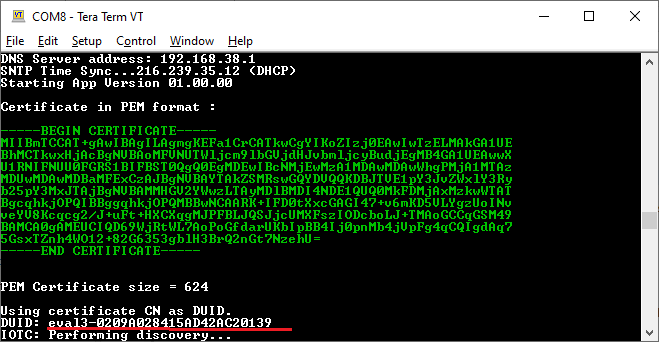

## Introduction

This document aims to provide a step-by-step-guide way to test and evaluate the 
[B-U585I-IOT02A STM32U4 Discovery kit for IoT](https://www.st.com/en/evaluation-tools/b-u585i-iot02a.html) board 
with IoTConnect and Trusted Firmware-M support.

This guide supports only Windows at this time.

## Required Software

* Download and install the [STM32CubeProgrammer software for STM32](https://www.st.com/en/development-tools/stm32cubeprog.html).
Please ensure that the 64-bit version is installed and into the default installation directory in C:\Program Files.
* You will need a serial console application for the next steps. We recommend [Tera Term](https://ttssh2.osdn.jp/index.html.en)
The serial console application needs to be configured per settings () in this screenshot:

## Firmware Setup

* Download and extract the [binary package zip](https://saleshosted.z13.web.core.windows.net/sdk/AzureRTOS/stm32u5-tfm-package-041823.zip)
* Plug in a USB cable into the Micro USB slot of the B-U585I-IOT02A board.
* Execute the trust-zone-enable.bat batch script from the package. 
This will enable the TrustZones feature which is required to run the next step.
Running this script will make it so only TrustZone enabled applications will run on the board.
You need to run this step only once per board. 
* Execute the tfm-update.bat batch script from the package.
* Once you are finished with the evaluation, you may want to run trust-zone-disable.bat batch script. 
The script will revert the board to factory setting where only non-TrustZone applications will run.

* Download and extract the [binary package zip](https://saleshosted.z13.web.core.windows.net/sdk/AzureRTOS/stm32u5-tfm-package-041323.zip)
* Execute the script tfm-update.bat. The script will upload several firmware components onto the board.

## Device Configuration

* In your terminal application enter "y" when prompted to set device configuration.
* Set values for WiFi SSID and Password, your CPID and Environment. 
You can find your CPID and Environment in the IoTConnect WebUI *Key Vault* page. 
* DUID value can be left unset, in which case a DUID  unique to your device 
will be printed on the console during startup.
* If using key based authentication enter the symmetric key. 
If symmetric key has no value, we will be using STSAFE and x509 authentication.
* If using x509 authentication with STSAFE secure element:
  * After configuring your device's settings, allow the device to boot. 
It will print information similar to the screenshot below.
  * If you have not set the DUID value, it will be generated and printed. 
  * Create a new device template with Self Signed authentication type. 
  * Copy the Device Certificate from the console, including the BEGIN and END, 
into a file device.pem.
  * You can use openssl to print device fingerprint, or you can use [this web site](https://www.samltool.com/fingerprint.php)

