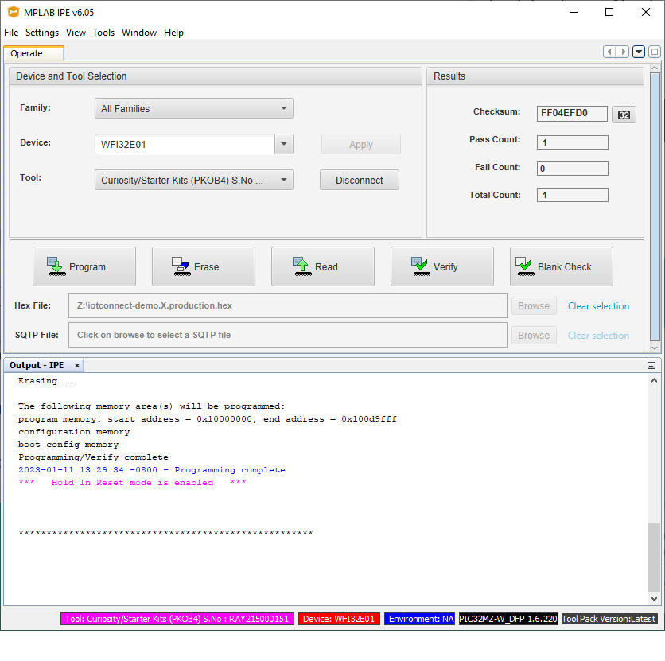
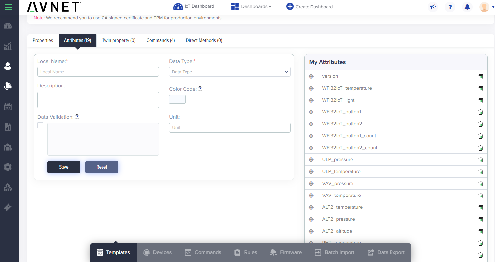
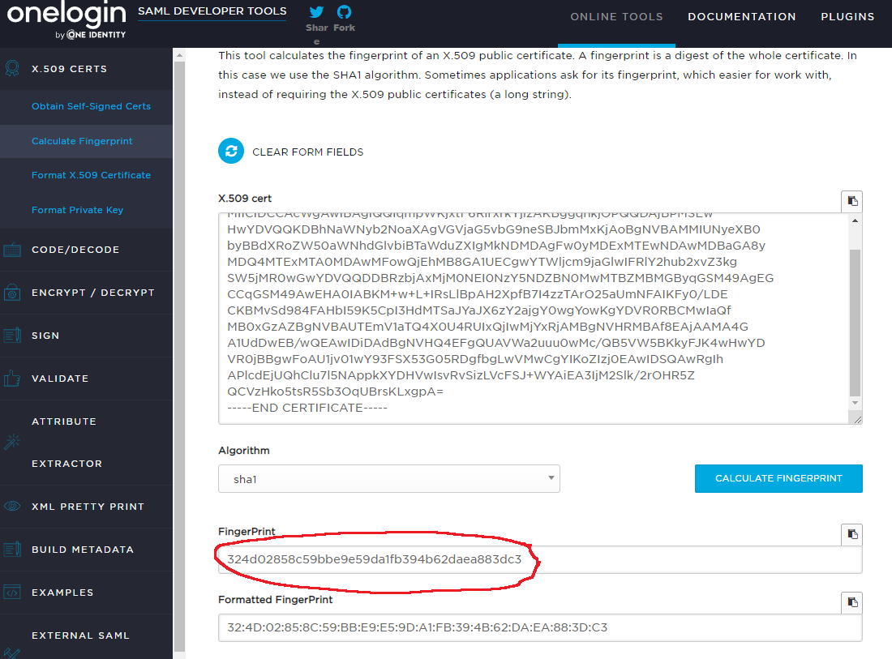
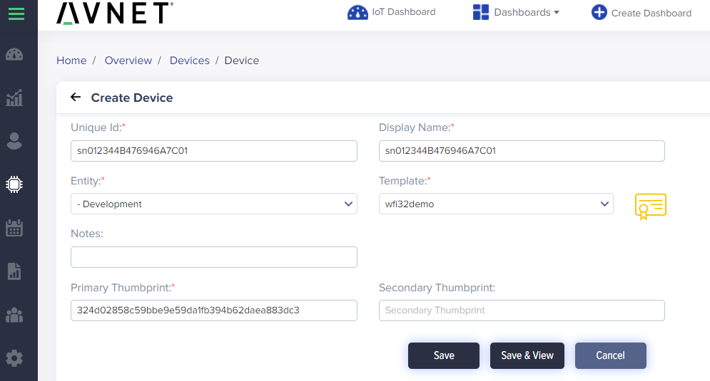

## Introduction

This document aims to provide an easy way to test and evaluate the 
[WFI32-IoT](https://www.microchip.com/en-us/development-tool/ev36w50a) board 
with IoTConnect, without the need to compile the source code.

The board features USB Mass Storage Device (MSD) support, which makes the IoTConnect setup simple and without the need
to change the source code.

The built-in ATECC608 secure element provides a quick and secure way 
to set up the device with IoTConnect.

The Click board interface makes it possible to make use of hundreds of different Click boards from MikroE.
The [VAV Press Click](https://www.mikroe.com/vav-press-click) 
, [Ultra-Low Press Click](https://www.mikroe.com/ultra-low-press-click)
, [PHT Click](https://www.mikroe.com/pht-click)
, [TEMP&HUM 14 click](https://www.mikroe.com/temphum-14-click)
, [Telaire T6713 CO2 Sensor Module](https://www.amphenol-sensors.com/en/telaire/co2/525-co2-sensor-modules/3399-t6713) on the [PROTO Click](https://www.mikroe.com/proto-click)
, [Telaire T9602 IP67 Harsh Environment Humidity & Temperature Sensor](https://www.amphenol-sensors.com/en/telaire/humidity/527-humidity-sensors/3224-t9602) on the [Terminal 2 Click](https://www.mikroe.com/terminal-2-click)
, [Air Quality 7 click](https://www.mikroe.com/air-quality-7-click)
, [Altitude 4 Click](https://www.mikroe.com/altitude-4-click)
, and [Altitude 2 Click](https://www.mikroe.com/altitude-2-click)
boards are directly supported by the demo software and provide 
the ability to send sensor readings from these boards directly to IoTConnect.

## Hardware Setup

* Plug the VAV Press Click or Ultra-Low Press Click board onto Click interface of the board.
* To have both Click boards connected at the same time to WFI32-IoT, you can connect them via the
[Shuttle Click](https://www.mikroe.com/shuttle-click) adapter.
* When connecting Click boards, ensure that the pin markings on the Click boards are matching to the header markings on the WFI32-IoT.
* The WFI32-IoT board needs to be connected to a USB port on your PC via the Micro USB cable.
* Once the board boots up, a new USB devices will be available. 
  * Optionally, connect a terminal program (like TeraTerm) to one of the two COM ports
which is named "USB Serial". Use defaults for 115200 baud: 8 bits, 1 stop bit, no flow control or parity. 
Firmware logs will be available on that COM port. 
  * The MSD should appear as a new removable drive some time after the board boots up.

## Programming the Firmware

* Download and install the [MPLAB X IDE package](https://www.microchip.com/en-us/tools-resources/develop/mplab-x-ide). 
MPLAB IPE and 32-bit device support are the only required options during the installation.
* Download the [binary package zip](https://saleshosted.z13.web.core.windows.net/sdk/AzureRTOS/iotconnect-demo-wfi32-040523.zip)
* Extract the iotconnect-demo.X.production.hex file from the zip.
* Open the Microchip IPE application in order to program the firmware: 
  * In the **Device** entry box, select "WFI32E01"
  * In the **Tool** entry box, select "Curiosity/Starter Kits (PKBO4)"
  * Click the **Connect** button
  * Wait for any updates to complete and ignore any DFP related warnings in the output.
  * After the device is connected, updated and verified (as reported in the output), click the **Browse** button next to the **Hex file** field and select your iotconnect-demo.X.production.hex file that was extracted in a previous step.
  * Click the **Program** button.
  * Screenshot below shows an example of what the IPE would look like once the device has been programmed successfully:



### IoTConnect Subscription Information

[IoTConnect](https://iotconnect.io) is availabe as a SaaS hosted subscription service or available as a PaaS subscription hosted on a client's infrastructure. SaaS IoTConnect subscriptions are available for business and personal accounts, and both are deployed on a production cloud instance.  Personal accounts are currently available through a North American instance of IoTConnect built on Microsoft Azure and is available for global use.  Personal IoTConnect accounts support between 1 and 100 devices, and can be setup in minutes through credit card payment on [IoTConnect Subscription Site](https://subscription.iotconnect.io/subscribe). Business SaaS accounts are available on both AWS and Azure, and deployed on EMEA and North American instances.  The Business SaaS platforms will support 1 to over a million devices, allow unlimited users, and can be setup in 1-business day through your local Avnet, Avnet Silica, Avnet Abacus, and EBV Elektronik account managment team. If you are not connected to an Avnet representative already, one can be reached by the "Contact Us" link on the Subscription Page. PaaS subscriptions are available in all Azure and AWS serviced regions, and require an Avnet license agreement and a cloud subscription service through Anvet or directly through the cloud sevices provider. 

For registration, you will need an email address, phone number, and unique company name. When you sign up for an account, you are creating an organizational instance.  You can add others later into this account with various permissions, including admistrative rights.  But note that users within the same organization, as well as device users, do not require their own seperate IoTConnect subscriptions.   

**IoTConnect Trial Account**  
A 2-Month Test Drive is available through the [IoTConnect Subscription Site](https://subscription.iotconnect.io/subscribe).  This version allows up to 5 devices, 5 users, and 30K messages per month, and does not require creditcard information for registration.  In addition, all paid tiers provide a 1-month trial period. The second month will be billed 30-days after sign-up and can be cancelled anytime through the [subcription management portal](https://subscription.iotconnect.io).


### IoTConnect Template Setup

* Login to the IoTConnect platform, navigate to Devices -> Device -> Templates and click "Create Template."
  * Enter a name like "wfi32demo" for **Template Code** and **Template Name**. 
  * Select *Self Signed Certificate* in the **Authentication Type** pulldown.
  * Ensure that **Device Message Version** is **1.0**
  * Click **Save**
* On the same page, click the Attributes tab.
* Add a field to the list of attributes called "version" of type **STRING** 
* Add the following **STRING** fields to the list of attributes:
  * *AIR7_Status* - Tells whether the Air Quality 7 Click board is warming up or is ready to report data.
  * *T6713_Status* - Tells whether the T6713 Sensor on the Proto Click board is warming up or is ready to report data.
  * *T9602_Status* - Tells whether the T9602 Sensor on the Terminal 2 Click board is warming up or is ready to report data.
* Add the following **NUMERIC** fields to the list of attributes. ULP or VAV fields are optional, if you have the Click Boards:
  * *WFI32IoT_temperature* - Note that this value seems rather high. It is likely measuring the chip internal temperature of the WFI32-IoT.
  * *WFI32IoT_light* - The amount light value reported by the light sensor on the WFI32-IoTboard.
  * *WFI32IoT_button1* - Will be set to 1, if button 1 was pressed before the telemetry data was sent. Button status will reset to 0 after the message is sent.
  * *WFI32IoT_button2* - Will be set to 1, if button 2 was pressed before the telemetry data was sent. Button status will reset to 0 after the message is sent.
  * *WFI32IoT_button1_count* - The number of times that button 1 was pressed since the board started or "reset-counters" command (see below) was issued. 
  * *WFI32IoT_button1_count* - The number of times that button 2 was pressed since the board started or "reset-counters" command (see below) was issued. 
  * *ULP_Pressure_Pa* - Air pressure (in Pascals) measured on the Ultra-Low Press Click Board.
  * *ULP_Temp_DegC* - Temperature (in degrees Celsius) measured on the Ultra-Low Press Click Board.
  * *VAV_Pressure_Pa* - Air pressure (in Pascals) measured on the VAV Press Click Board.
  * *VAV_Temp_DegC* - Temperature (in degrees Celsius) measured on the VAV Press Click Board.
  * *ALT2_altitude* - Altitude above sea level measured on the Altitude 2 Press Click Board. 
  * *ALT2_temperature* - Temperature measured on the Altitude 2 Press Click Board.
  * *ALT2_pressure* - Air pressure measured on the Altitude 2 Press Click Board.
  * *PHT_temperature* - Temperature measured on the VAV Press Click Board.
  * *PHT_pressure* - Air pressure measured on the PHT Click Board.
  * *PHT_humidity* - Air humidity measured on the PHT Click Board.
  * *TEMPHUM14_temperature* - Temperature measured on the TEMP&HUM 14 Board.
  * *TEMPHUM14_humidity* - Air humidity measured on the TEMP&HUM 14 Board.
* The screenshot below shows an example template:



* Add the following commands in the *Commands* tab:
  * *led-red*   - Toggle the *Parameter Required* toggle button to *enabled*. If parameter is set to "on", the red LED on the board next to the reset switch will be turned on. 
  * *led-green* - Toggle the *Parameter Required* toggle button to *enabled*. If parameter is set to "on", the green LED on the board next to the reset switch will be turned on. 
  * *led-blue*  - Toggle the *Parameter Required* toggle button to *enabled*. If parameter is set to "on", the blue LED on the board next to the reset switch will be turned on.
  * *reset-counters* - When issued, this command will reset the running counters for button 1 and 2 presses.

## Obtaining the Device Certificate Fingerprint

This section outlines how to set up the device for IoTConnect Self Signed Certificate authentication type.
Steps for other authentication types are out of scope for this guide and are available in the main README.md.

* In order to complete the next steps, obtain the fingerprint of device certificate.
The device certificate is located in the MSD in the file named snXXXXXX_device.pem.
The fingerprint of the certificate can be either SHA256 or SHA1.
There are a couple of ways to go about that:
   * One can execute ``` openssl x509 -noout -fingerprint -inform pem -in snxXXXX_device.pem ``` if openssl is installed.
   * The contents of snxXXXX_device.pem can be pasted into an online
fingerprint calculator such as [this one](https://www.samltool.com/fingerprint.php). 
Note that publishing the device certificate or fingerprint online is not technically unsafe 
because the certificate must be paired by the private key derived data during authentication. 
The private key is securely stored on the device and cannot be accessed even programmatically.
The only information that may potentially "leak" by using a public web site in this fashion is the informational 
manufacturer data, including the device serial number. Below is a sample screenshot:



### Setting up the Device in IoTConnect
 
* Navigate to Device -> Device and click the **Create Device** button.
* Your device unique ID is the "snXXXXXXXX" collection numbers and letters by which the files on the MSD are created. 
Enter that name (including "sn") as the device name and display name.
* Choose your entity where you will create the device.
* Select the Template that was created in a previous step.
* Enter the fingerprint obtained in the previous step (without colons) as the **Primary Thumbprint**. See screenshot below.
* Click **Save**.



### Setting up the WIFI.CFG file.

* The WIFI.CFG file is located on the MSD. Open the file in a text editor and input the WiFi credentials using one of the
following templates per the network configuration:
   - Open Unsecured Network (no password protection)
        ```bash
        CMD:SEND_UART=wifi MY_SSID,,1
        ```
    - Wi-Fi Protected Access 2 (WPA2)
        ```bash
        CMD:SEND_UART=wifi MY_SSID,MY_PSWD,2
        ```
    - Wired Equivalent Privacy (WEP)
        ```bash
        CMD:SEND_UART=wifi MY_SSID,MY_PSWD,3
        ```
    - Wi-Fi Protected Access 3 (WPA3)
        ```bash
        CMD:SEND_UART=wifi MY_SSID,MY_PSWD,4
        ```
* Save the file when done.


### Setting up the CLOUD.CFG file

* Ensure that you eject the drive after making any changes to the files, and then restarting the board.
The PC filesystem may be caching the file contents, and it may not allow the device to complete writing to the device before a restart.
* Open the CLOUD.CFG file in a text editor. If the contents of CLOUD.CFG do not have text like CPID and ENV, 
delete the file, eject the drive, restart the board and re-open the file.
Restarting will populate the defaults.
* Set the CPID and Environment per your IoTConnect account settings, which can be found in Settings -> Key Vault in your IoTConnect portal.
* Save the file, eject the drive and restart the board.
* Your device should connect to your IoTConnect account and publish sensor data periodically.
