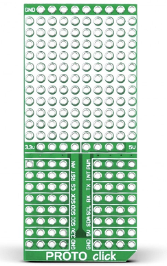
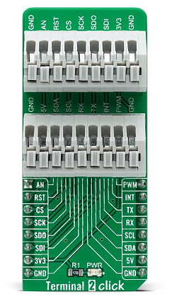

## Introduction
This document describes how to connect the WFI32-IoT Development Board (featuring the fully certified, highly integrated WFI32E01PC wireless module) to Avnet IoTConnect built on Microsoft Azure Cloud services, including Azure IoT Hub, and leverages Azure RTOS to enable better experiences of embedded firmware development for Cloud applications.

## Table of Contents
- [Introduction](#introduction)
- [Adding Extra Sensors to the WFI32 IoT Board](#adding-extra-sensors-to-the-wfi32-iot-board)
- [Program the WFI32-IoT Development Board](#program-the-wfi32-iot-development-board)
- [References](#references)
- [Conclusion](#conclusion)

### WFI32-IoT Development Board Overview & Features (SMART \| CONNECTED \| SECURE)

Download the [WFI32-IoT Development Board User Guide](https://www.microchip.com/content/dam/mchp/documents/WSG/ProductDocuments/UserGuides/EV36W50A-WFI32-IoT-Board-Users-Guide-DS50003262.pdf) for more details including the schematics for the board (but do not follow the setup procedure in the document)

## Adding Extra Sensors to the WFI32 IoT Board
Even though each WFI32E01 Development Board has its own on-board light and temperature sensors, additional sensors can optionally be added relatively quickly using existing off-the-shelf hardware. 

The WFI32E01 Development Board, like many Microchip development boards, features a 16-pin (2 rows x 8 pins) expansion socket which conforms to the [mikroBUS™ specification](https://download.mikroe.com/documents/standards/mikrobus/mikroBUS-standard.pdf). The mikroBUS™ standard defines mainboard sockets used for interfacing microcontrollers or microprocessors (mainboards) with integrated circuits and peripheral modules (add-on boards).

The standard specifies the physical layout of the mikroBUS™ pinout, the communication and power supply pins used, the positioning of the mikroBUS™ socket on the mainboard, and finally, the silkscreen marking conventions for both the sockets. The purpose of mikroBUS™ is to enable easy hardware expandability with a large number of standardized compact add-on boards, each one carrying a single sensor, transceiver, display, encoder, motor driver, connection port, or any other electronic module or integrated circuit. Created by [MikroElektronika](https://www.mikroe.com), mikroBUS™ is an open standard — anyone can implement mikroBUS™ in their hardware design.

MikroElektronika manufactures hundreds of ["Click" boards](https://www.mikroe.com/click) which conform to the mikroBUS™ standard. While the existing library of Click boards covers the majority of use cases, there are also customizable Click board options that allow users to connect other 3rd-party sensors to the WFI32E01 using mikroBUS™. This demonstration currently supports the optional addition of up to 9 MikroElektronika Click boards which feature various sensors.

### "Air Quality 7" Click Board

[Air Quality 7 Click](https://www.mikroe.com/air-quality-7-click) is a compact add-on board that combines state-of-the-art MOS sensor technology with intelligent detection algorithms to monitor VOCs and CO2 equivalent variations in confined spaces. This board features the [MiCS-VZ-89TE](http://download.mikroe.com/documents/datasheets/MiCS-VZ-89TE_datasheet.pdf), an integrated sensor module for indoor air quality monitoring from Amphenol. This Click board™, an I2C configurable environmental sensor board, has many features such as low power, wide VOCs detection range, high sensitivity, and high resistance to shocks and vibrations which make it an excellent choice for VOC and CO2 monitoring in confined spaces such as meeting rooms and vehicle cabins, saving energy and reducing cost-of-ownership.

### "Altitude 2" Click Board

[Altitude 2 Click](https://www.mikroe.com/altitude-2-click) is a high-resolution barometric pressure sensor add-on Click board™. It carries the [MS5607](https://www.te.com/commerce/DocumentDelivery/DDEController?Action=showdoc&&DocId=Data+Sheet%7FMS5607-02BA03%7FB3%7Fpdf%7FEnglish%7FENG_DS_MS5607-02BA03_B3.pdf%7FCAT-BLPS0035), a barometric pressure sensor IC with the stainless steel cap, produced by TE Connectivity. This sensor provides very accurate measurements of temperature and atmospheric pressure, which can be used to calculate the altitude with a very high resolution of 20cm per step. Besides that, the Besides that, the device also includes features such as the ultra-low noise delta-sigma 24bit ADC, low power consumption, fast conversion times, pre-programmed unique compensation values, and more. Low count of external components requirement, along with the simple interface which requires no extensive configuration programming, makes this sensor very attractive for building altitude or air pressure measuring applications.

### "Altitude 4" Click Board

[Altitude 4 Click](https://www.mikroe.com/altitude-4-click) introduces an absolute pressure sensor with digital output for low-cost applications labeled as [NPA-201](http://download.mikroe.com/documents/datasheets/AAS-920-649D-NovaSensor-NPA201-041318-web.pdf). Altitude 4 click employs a MEMS pressure sensor with a signal-conditioning IC to provide accurate pressure measurements from 260 to 1260 mBar. Measurement values are provided at the digital output pins through an I2C interface. This sensor provides NPA-201 Digital Output Absolute Pressure Sensor provides low power consumption and compact size, making it ideal for battery-powered and mobile applications or any application where size is a constraint. In today’s growing market for portable electronics and wearables with multiple parameters being measured, many applications require an accurate measurement of barometric pressure to determine factors such as altitude.

### "PHT" Click Board

[PHT Click](https://www.mikroe.com/pht-click) is a compact add-on board that contains a PHT combo sensor. This board features the [)MS8607](https://www.te.com/commerce/DocumentDelivery/DDEController?Action=showdoc&&DocId=Data+Sheet%7FMS8607-02BA01_%7FC3%7Fpdf%7FEnglish%7FENG_DS_MS8607-02BA01__C3.pdf%7FMS860702BA01-50), a digital combination sensor providing 3 environmental measurements all-in-one: pressure, humidity, and temperature from TE Connectivity. This sensor is based on leading MEMS technologies, provides factory-calibrated PHT data available over an I2C serial interface. The standout feature of the MS8607, alongside its very respectable low power consumption at as low as 0.78 µA, is also ultra-low power consumption and high PHT accuracy. This Click board™ is appropriate for environmental monitoring, as well as PHT applications such as HVAC and weather stations.

### T6713 CO2 Sensor on the "PROTO" Click Board

[Telaire T6713 CO2 Sensor Module](https://www.amphenol-sensors.com/en/telaire/co2/525-co2-sensor-modules/3399-t6713) is ideal for applications where CO2 levels need to be measured and controlled for indoor air quality and energy saving applications, such as demand control ventilation. All units are factory calibrated to measure CO2 concentration levels up to 5000 ppm.

[PROTO Click](https://www.mikroe.com/proto-click) is an accessory Click board™ used as a construction base for prototyping electronics in mikroBUS™ form factor. It features a 10x11 prototyping area and additional power pads providing an easy and elegant solution for adding the external connection capability to the Click board™, plugged on a mikroBUS™ socket. This Click board™ represents a cheap and effective solution for creating a board that suits your project needs.

### T9602 Temp&Hum Sensor on the "Terminal 2" Click Board

[Telaire T9602 IP67 Harsh Environment Humidity & Temperature Sensor](https://www.amphenol-sensors.com/en/telaire/humidity/527-humidity-sensors/3224-t9602)is a fully-calibrated and temperature-compensated combined humidity and temperature sensor supplied in a water-resistant IP67 package, making it the most advanced and cost-effective sensing solution for virtually any type of harsh environment application. Telaire T9602 provides linearized output signals in one of two interfaces – Digital (I2C) Output or Pulse Density Modulated (PDM) Output convertible to an analog signal – to meet a wider range of customer requirements.

[Terminal 2 Click](https://www.mikroe.com/terminal-2-click) is an adapter Click board™ used as a mikroBUS™ socket expansion board. It provides an easy and elegant solution for adding the external connection capability to the Click board™, plugged on a mikroBUS™ socket. Featuring two 9-position 2.54mm pitch terminal blocks makes it an easy way to expand the development system's connectivity with the mikroBUS™ socket while keeping the bus free to use with any Click board™.

### "TEMPHUM14" Click Board

[TEMPHUM14 Click](https://www.mikroe.com/temphum-14-click) is a compact add-on board that contains one of the smallest and most accurate humidity and temperature sensors on the market. This board features the [HTU31D](https://www.te.com/commerce/DocumentDelivery/DDEController?Action=showdoc&DocId=Data+Sheet%7FHTU31_RHT_SENSOR_IC%7F3%7Fpdf%7FEnglish%7FENG_DS_HTU31_RHT_SENSOR_IC_3.pdf%7FCAT-HSC0007), a highly accurate digital relative humidity sensor with temperature output from TE Connectivity. With power consumption down to 3.78μW and accuracy of ±2%RH and ±0.2°C, this Click board™ provides fast response time, precision measurement, low hysteresis, and sustained performance even when exposed to extreme temperature up to 125°C and humidity environments. This Click board™ is suitable for relative humidity and temperature measuring applications, including weather stations, reliable monitoring systems, and more.

### "Ultra-Low Press" Click Board

[Ultra-Low Press Click](https://www.mikroe.com/ultra-low-press-click) is a compact add-on board that contains a mountable gage pressure sensor for pneumatic pressure measurements. This board features the [SM8436](https://www.te.com/usa-en/product-8436-BBA-S-500-000.datasheet.pdf), an I2C configurable ultra-low pressure sensor with high accuracy and long-term stability from Silicon Microstructure (part of TE Connectivity). A state-of-the-art MEMS pressure transducer technology and CMOS mixed-signal processing technology produces a digital, fully conditioned, multi-order pressure and temperature compensated sensor like this available in a gage pressure configuration. It also features superior sensitivity needed for ultra-low pressure measurements ranging from 0 to 250Pa Differential / 500 Pa Gauge. Therefore, this Click board™ is suitable for differential pressure measurements found in pressure monitoring applications like building fire safety systems, isolation rooms, and high purity work stations as well as positive pressure solutions found in hospital surgical environments.

### "VAV Press" Click Board

[VAV Press Click](https://www.mikroe.com/vav-press-click) is a compact add-on board that contains a board-mount pressure sensor. This board features the [LMIS025B](https://www.first-sensor.com/cms/upload/datasheets/DS_Standard-LMI_E_11823.pdf), a low differential pressure sensor from First Sensor (part of TE Connectivity). It is based on thermal flow measurement of gas through a micro-flow channel integrated within the sensor chip. The innovative LMI technology features superior sensitivity, especially for ultra-low pressures ranging from 0 to 25 Pa. The extremely low gas flow through the sensor ensures high immunity to dust contamination, humidity, and long tubing compared to other flow-based pressure sensors. This Click board™ is suitable for pressure measurements in Variable Air Volume (VAV) building ventilation systems, industrial, and respiratory applications in medical.

### Stacking Click Boards

Any combination of up to 4 of these Click boards can be connected to the WFI32E01 Development Board at the same time using the MikroElektronika [Shuttle Bundle](https://www.mikroe.com/mikrobus-shuttle-bundle) accessory kit. The bundle features the [Shuttle click](https://www.mikroe.com/shuttle-click) 4-socket expansion board, which provides an easy and elegant solution for stacking up to four Click boards™ onto a single mikroBUS™ socket. It is a perfect solution for expanding the capacity of the development system with additional mikroBUS™ sockets when there is a demand for using more Click boards™ than the used development system is able to support.

## Program the WFI32-IoT Development Board
Please refer to instructions Microchip [here](https://github.com/MicrochipTech/AzureDemo_WFI32E01#program-the-wfi32e01-development-board)

## References

Refer to the following links for additional information for IoT Explorer, IoT Hub, DPS, Plug and Play model, and IoT Central

•	[IoTConnect overview](https://help.iotconnect.io/knowledgebase/iotconnect-overview/)

•	[IotConnect quick start guide](https://help.iotconnect.io/knowledgebase/quick-start/)

•	[Onboard a device with IoTConnect](https://help.iotconnect.io/knowledgebase/device-onboarding/)

•	[Configure to connect to IoT Hub](https://docs.microsoft.com/en-us/azure/iot-pnp/quickstart-connect-device-c)

•	[Avnet IoTConnect - All Documentation](https://help.iotconnect.io/)

•	[How to connect devices with X.509 certificates for IoTConnect](https://help.iotconnect.io/knowledgebase/x-509-self-singed-certificate/)

•	[Create a new dashboard using the dynamic dashboard feature](https://help.iotconnect.io/documentation/dashboard/create-a-new-dashboard/)

## Conclusion

You are now able to connect WFI32-IoT to Avnet IoTConnect and should have deeper knowledge of how all the pieces of the puzzle fit together between Microchip's hardware and Microsoft's Azure Cloud services. Let’s start thinking out of the box and see how you can apply this project to provision securely and quickly a massive number of Microchip devices to Azure and safely manage them through the entire product life cycle.

